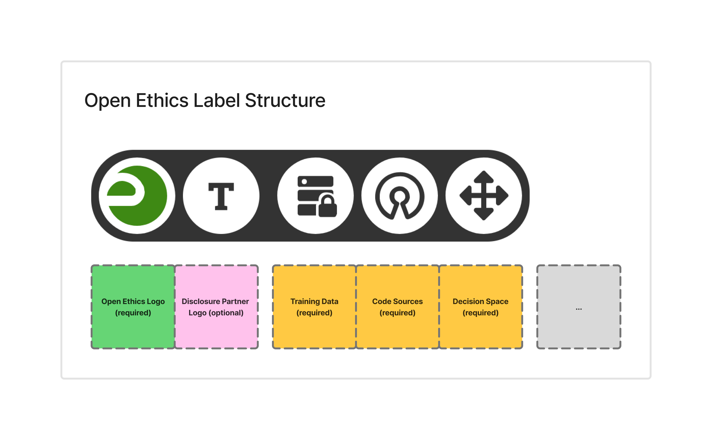

# Open Ethics Label (OEL)

This repository contains Open Ethics Label content and integration examples for adding ethical transparency labels to websites and AI-powered applications. The intended use of this repository is for developers and Open Ethics network partners only.

Those willing to generate the label for their product, should directly use [this link](http://openethics.ai/label/generate/) to fill in the disclosure form.

## Repository Structure

```
.
├── examples/                       # Integration examples
│   ├── disclosure form/            # Integration examples for the Disclosure Form, for partners
│   │   ├── label-demo-page.html    # Demo page showing label integration
│   │   ├── oel-form.js             # JavaScript for form integration, hosted on "https://openethics.ai/src/js/oel-form.js"
│   │   └── oel-iframe-snippet.html # HTML snippet for iframe embedding. The content is the same as generated by the JS file
│   └── label widget/               # Widget examples with Label rendering, for product owners
│       └── oel.html                # Example label widget implementation
│
├── src/                            # Source files
│   ├── css/                        # Stylesheets for label rendering
│   ├── favicon/                    # Favicon assets in various sizes
│   ├── images/                     # Label SVG images and assets
│   └── js/                         # JavaScript modules
│       └── functions.js            # Core label rendering functions
│
├── .htaccess                       # Apache server configuration
├── index.html                      # Main label page for iframe rendering
└── LICENSE                         # MIT License
```

## Labels
Labels are the SVG images stored in `src/images/`.

## Label Structure



## Examples
### Widget with an iframe

The label widget could be intalled by the developer by copy-pasting the generated code from `oel.html`. The code snippet that product owners will get after submitting the [disclosure form](http://openethics.ai/label/generate/) will contain the iframe sourcing content from `label.openethics.ai` based on the parameters specified in the `src` of the request.

ATTENTION: the `oel.html` in [examples/widget/oel.html](examples/widget/oel.html) is provided just as an example and product owners should obtain their own oel.html by filling in the [disclosure form](http://openethics.ai/label/generate/).

```html
<iframe src="https://label.openethics.ai?&accent_oe=3E8914&url=testexample.com&data=open&source=open&decision=restricted&integrity=156d624b8f2dbea87128a2147f255842652475c5dc595c79f64c90c7ff486d59007c3e18c993e3163395812e26b70ea70dfc413f7ca128869d115f12e5699bf2" style="border:0px #ffffff none;" name="oe_label" scrolling="no" frameborder="1" marginheight="0px" marginwidth="0px" height="50px" width="300px" allowfullscreen></iframe>
```


### Partner Integration of the disclosure form
As a network partner, you can integrate the Open Ethics Label disclosure form into your website:

1. Include the label form using the JavaScript integration:

```html
<div id="oel_form"></div>
<script src="https://openethics.ai/src/js/oel-form.js"></script>
<script>
    initializeOpenEthicsLabelForm("YOUR_PARTNER_KEY", "YOUR_ALIAS", "#oel_form");
</script>
```

2. Or use the iframe snippet from `examples/integration/oel-iframe-snippet.html`

See the examples directory for complete integration demos.

## License

This project is licensed under the MIT License - see the [LICENSE](LICENSE) file for details.
